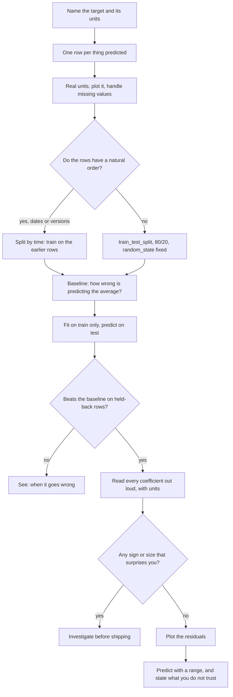

# Linear regression cheat sheet

The order to do things in, what each step is for, and what to do when the
numbers come out strange.

Fitting the model is three lines. Everything either side of those three lines
is the actual work, and it is where marks and jobs are won or lost.

## The flowchart




## The same thing as ten steps

| # | Step | The question it answers | The code |
|---|---|---|---|
| 1 | Name the target | What am I predicting, in what units? | — |
| 2 | Shape the data | One row per thing being predicted? | `df.groupby(...).agg(...)` |
| 3 | Real units | Can I read a coefficient when I get one? | `df["temp_c"] = df["temp"] * 41` |
| 4 | Look | Is there a relationship at all? Is it straight? | `plt.scatter(x, y)` |
| 5 | Clean | Any missing values, any text columns? | `df.isna().sum()`, `df.dtypes` |
| 6 | Split | What will I test on that the model never saw? | `train_test_split(X, y, test_size=0.2, random_state=42)` |
| 7 | Baseline | What does "good" have to beat? | `root_mean_squared_error(y_test, [y_train.mean()] * len(y_test))` |
| 8 | Fit | — | `model = LinearRegression().fit(X_train, y_train)` |
| 9 | Score on held-back rows | Is it better than the baseline? | `root_mean_squared_error(y_test, model.predict(X_test))` |
| 10 | Read it | What is it actually claiming about the world? | `model.coef_`, `model.intercept_` |

Steps 6 and 7 come **before** step 8. Doing them afterwards is the single most
common way to fool yourself.

## The whole thing in fifteen lines

```python
import pandas as pd
from sklearn.linear_model import LinearRegression
from sklearn.model_selection import train_test_split
from sklearn.metrics import mean_absolute_error, root_mean_squared_error, r2_score

FEATURES = ["temp_c", "humidity_pct"]      # the columns we look at
TARGET = "rides"                            # the column we want

X_train, X_test, y_train, y_test = train_test_split(
    daily[FEATURES], daily[TARGET], test_size=0.2, random_state=42)

baseline = [y_train.mean()] * len(y_test)
print("baseline RMSE:", root_mean_squared_error(y_test, baseline))

model = LinearRegression().fit(X_train, y_train)
prediction = model.predict(X_test)

print("model RMSE   :", root_mean_squared_error(y_test, prediction))
print("model MAE    :", mean_absolute_error(y_test, prediction))
print("R squared    :", r2_score(y_test, prediction))
print("intercept    :", model.intercept_)
for name, coefficient in zip(FEATURES, model.coef_):
    print("  %-14s %+.2f" % (name, coefficient))
```

## Which score, and what it means

| Score | Units | Use it to say |
|---|---|---|
| MAE | same as the target | "typically out by this much" |
| RMSE | same as the target | same, but one disastrous row hurts far more than several small misses |
| R² | none | "the model accounts for this share of the variation" |

$$ \text{MAE} = \frac{1}{n}\sum \lvert y_i - \hat{y}_i \rvert
\qquad
\text{RMSE} = \sqrt{\frac{1}{n}\sum (y_i - \hat{y}_i)^2}
\qquad
R^2 = 1 - \frac{\sum (y_i - \hat{y}_i)^2}{\sum (y_i - \bar{y})^2} $$

Quote MAE or RMSE to whoever asked the question, because those are in their
units. Quote R² when comparing two models on the same target.

**Always score on the held-back rows.** A score on the training rows tells you
how well the model memorised, not how well it learned.

## Which split

| The rows are... | Split | Why |
|---|---|---|
| independent of each other | random, `random_state` fixed | every row is equally likely to be the future |
| in time order | train on earlier, test on later | tomorrow is always after today, and a random split lets the model see the future |
| grouped, e.g. several rows per patient or per shop | keep whole groups together | otherwise the model sees the same patient in both halves |

If you are not sure, do both and compare. A big gap between them is a finding,
not a nuisance.

## When it goes wrong

| What you see | What it usually means | What to do |
|---|---|---|
| R² is negative | Worse than predicting the average. Usually something systematic the model cannot see, such as a trend over time | Plot the target against date or row order. Add the missing column |
| Great on training, poor on test | Memorising, not learning | Fewer or better features. This is overfitting |
| Poor on both | The features genuinely do not explain the target, or the relationship is not straight | Plot it. Consider a squared term, or accept the ceiling |
| A coefficient has the wrong sign | Often two features carrying the same information | Check the correlation between features. Drop one and see if the sign flips back |
| One feature has a huge coefficient | Usually a units problem, not importance | Coefficients are only comparable if the columns are on comparable scales |
| Residuals show a curve or a fan | A straight line is the wrong shape here | Transform a feature, or say plainly that linear is not enough |
| Prediction is impossible, e.g. negative sales | The line does not know your quantity has a floor | Report it honestly, cap it, and say why |
| The model is wrong in the same direction nearly every time | Bias: something systematic is missing | Look for a variable that changes steadily. "Noisy" and "biased" are different problems |

## Error messages you will actually meet

| Message | Cause | Fix |
|---|---|---|
| `Expected a 2-dimensional container but got <class 'pandas.core.series.Series'>` | `df["col"]` gives one dimension, sklearn wants two | Double brackets: `df[["col"]]` |
| `Input X contains NaN` | Missing values | `df.isna().sum()` first, then fill or drop, deliberately |
| `could not convert string to float: 'spring'` | A text column in the features | Encode it, e.g. `pd.get_dummies`, or leave it out |
| `The feature names should match those that were passed during fit` | Predicting with different columns, or a different order | Keep one `FEATURES` list and use it everywhere |
| `X does not have valid feature names, but LinearRegression was fitted with feature names` | Fitted on a DataFrame, predicting on a plain array | Predict on a DataFrame with the same column names |

## Before you call it finished

Say these five sentences out loud. If you cannot, you are not done.

1. I am predicting **what**, measured in **what units**.
2. My model is typically out by **N units**, against **M units** for predicting
   the average.
3. Feature X means: one more unit of X, everything else held still, is worth
   **N units** more of the target.
4. I tested on rows the model never saw, split **this way**, for **this reason**.
5. The prediction I trust least is **this one**, because **this**.

## Where this is taught

- `modules/04-regression/notebooks/regression-basics.ipynb` — the line, the cost
  function, the matrix form, train and test splits
- Module 4 Part 2 — R², overfitting, feature selection, regularisation
